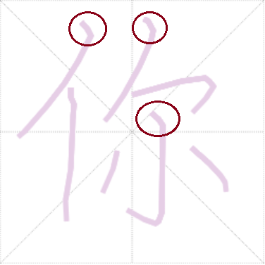

# HanziLookupJS
Free, open-source Chinese handwriting recognition in Javascript.

The library is based on Jordan Kiang's [HanziLookup] (http://kiang.org/jordan/software/hanzilookup). It contains data derived from Shaunak Kishore's [Make Me a Hanzi] (https://github.com/skishore/makemeahanzi), and an improved character recognition algorithm.

## Getting started
You can use the library immediately if you clone the repository and open the `index.html` file in the /demo folder in a browser. To use the library in your own application:

- Include `hanzilookup.min.js` in your page, or bundle it with your application.

- Include at least one of the data files in your page. These files are not bundled in `hanzilookup.min.js` because they take a second or two to download and initialize. You should load them asynchronously to avoid delaying your page load; see `demo.html` for a way to do this.

- If you build your own UI for inputting strokes, then all you need is the code from the demo page's `lookup()` function:

        // Decompose character from drawing board
        var analyzedChar = HanziLookup.AnalyzedCharacter(_drawingBoard.cloneStrokes());
        // Look up with original HanziLookup data
        var matcherHL = HanziLookup.Matcher(HanziLookup.StrokeDataHL);
        var matchesHL = matcherHL.match(analyzedChar, 8);

  The constructor of `AnalyzedCharacter` takes an array of strokes. Every stroke, in turn, consists of an array of points. Every point is a two-dimensional array representing its X and Y coordinates.
  
  To instantiate `Matcher` you need to pass the character repository you wish to use. You can choose from two: `HanziLookup.StrokeDataHL` or `HanziLookup.StrokeDataMMAH`. They are initialized by the respective data scripts that you have added to your page asynchronously.
  
  The matcher is a fairly lightweight object, but you only need one instance throughout your page's lifetime. To look up a new character, just pass the `AnalyzedCharacter` object to its `match` function. The second argument specifies how many candidates you want to receive. The function returns an array of matches (best first). In each match you're interested in the `character` member.
  
 ## The two data files
 
The file `x-hl-strokes.js` contains the original data from Jordan Kiang's HanziLookup. In this file, character entries contain the character's stroke count, plus a flat list of substrokes, each consisting of a direction and a normalized length. NN characters are encoded this way, but there are multiple entries for some to account for alternative ways fo writing them.
 
The file `x-mmah-strokes.js` is derived from Make Me a Hanzi's `graphics.txt` and encodes 9507 characters. This file is richer because it also contains the normalized location (center point) of every substroke. The matching algorithm recognizes at runtime that this information is present and calculates the score accordingly: a substroke that is in the wrong places counts for less.

Deriving `x-mmah-strokes.js` from `graphics.txt` consists of a little more than calculating the direction/length/location values for substrokes. Because MMAH's geometric data is derived from a Kai font, the medians (centerlines) contain an odd initial substroke for some stroke types, as shown in the image below:

